# OrderService

.NET microservice to listen to a queue in RabbitMQ and save data to Postgres database

## System Architecture

```mermaid
graph LR
A[OrderAPI .NET 7] --> C(Postgres Database)
B((RabbitMQ)) -- " 📨" --> D[OrderService .NET 7]
D --> C
```



### Docker Hub RabbitMQ Repository

https://hub.docker.com/repository/docker/patrickamaral/rabbitmq/general

### Docker Hub Postgres Repository
https://hub.docker.com/repository/docker/patrickamaral/orders_postgres/general

### Database populate script
https://github.com/patrick-jose/OrderService/blob/master/DataBaseBackup.sql

### Database model diagram


### Queue payload examples:
```go

[
	{
		"codigoPedido":1003,
		"codigoCliente":10,
		"itens":
		[
			{
				"id":2,
				"produto":"Lapis",
				"preco":12.9,
				"quantidade":2
			},
			{
				"id":8,
				"produto":"Estojo",
				"preco":7.99,
				"quantidade":5
			},
			{
				"id":6,
				"produto":"Borracha",
				"preco":0.5,
				"quantidade":3
			}
		]
	},
	{
		"codigoPedido":1004,
		"codigoCliente":11,
		"itens":
		[
			{
				"id":2,
				"produto":"Lapis",
				"preco":12.9,
				"quantidade":2
			}
		]
	},
	{
		"codigoPedido":1005,
		"codigoCliente":12,
		"itens":
		[
			{
				"id":1,
				"produto":"Caderno",
				"preco":10,
				"quantidade":2
			},
			{
				"id":4,
				"produto":"Fita Durex",
				"preco":5,
				"quantidade":2
			},
			{
				"id":5,
				"produto":"Envelope Pardo",
				"preco":0.25,
				"quantidade":10
			},
			{
				"id":6,
				"produto":"Borracha",
				"preco":0.5,
				"quantidade":1
			},
			{
				"id":3,
				"produto":"Caneta",
				"preco":1,
				"quantidade":2
			}
		]
	}
]

[
	{
		"codigoPedido": 1001,
		"codigoCliente":1,
		"itens": 
		[
			{
				"produto": "lápis",
				"quantidade": 100,
				"preco": 1.10
			},
			{
				"produto": "caderno",
				"quantidade": 10,
				"preco": 1.00
			}
		]
	}
]
```
